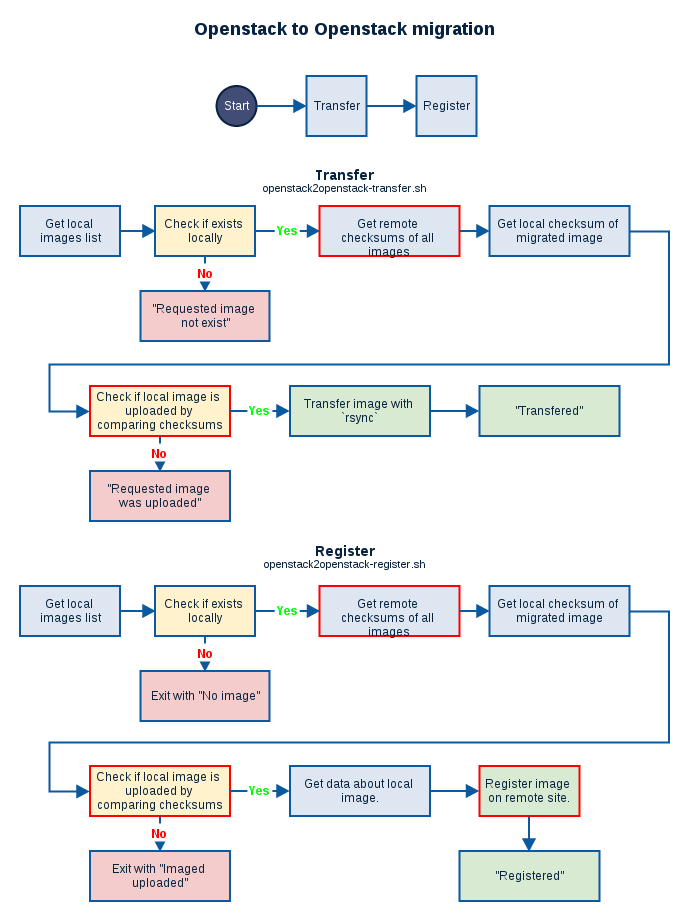
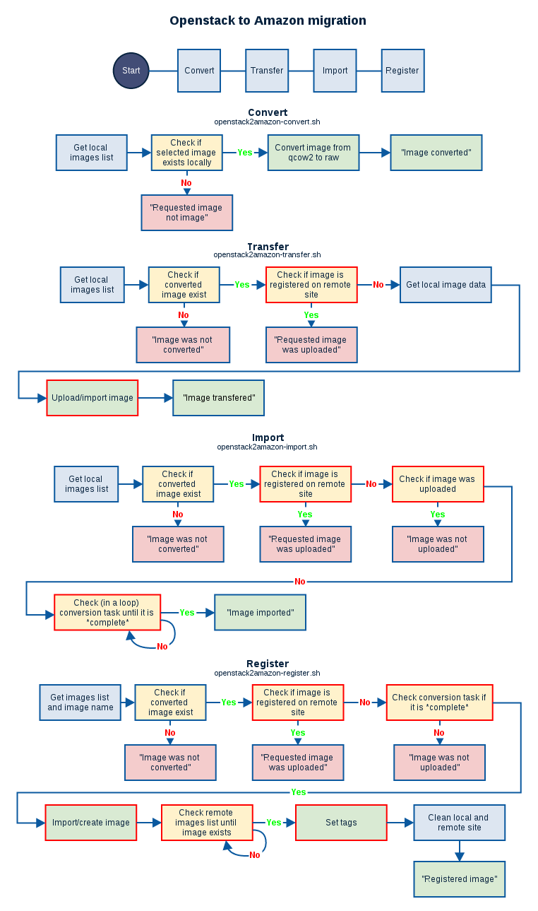

# Migratio

This application provides service which allow performing virtual machine template migration between Compute Sites managed by [Atmosphere](https://github.com/dice-cyfronet/atmosphere).

## Usage

This application will be used in two ways:

* as a standalone application, on *Compute Site*, mainly on *OpenStack* `head-node` or any other `node` which can access the following:
  * *Nova* API client
  * *Glance* image repository
  * *Qemu* image tools
  * target *Compute Site* via *ssh/rsync* with *Nova* and *Glance* services
* as a gem inside the *Atmosphere* service

## Installation

### Requirements

**This project is designed for Linux operating systems.**

- *Linux* (tested on Ubuntu)
- *Ruby* 2.0+
- *Redis* (can be installed on separate server)
- *OpenStack* (with `nova` and `glance` commands available for user who runs *migratio* and runs remote commands on external site)
- *Amazon EC2 CLI Tools* (with `ec2-*` commands available for user who runs `migratio`; requires: *Java Runtime Environment*)
- *AWS CLI Tools* (with `aws` command, requires: *python* and *pip*)
- Tools such as `ssh`, `rsync`

### Packages / Dependencies

Update your system (as root, **optional**):

    aptitude update
    aptitude upgrade

Install additional packages required by `ruby` (as root, **optional**):

    aptitude install g++ make autoconf bison build-essential libssl-dev libyaml-dev libreadline6 libreadline6-dev zlib1g zlib1g-dev

Install `ruby` and `bundler` (as root, **optional**):

    mkdir /tmp/ruby
    pushd /tmp/ruby
    curl --progress http://ftp.ruby-lang.org/pub/ruby/2.1/ruby-2.1.2.tar.gz | tar xz
    pushd /tmp/ruby/ruby-2.1.2
    ./configure --disable-install-rdoc
    make
    make install
    gem install bundler --no-ri --no-rdoc
    popd
    popd

Install this software (as non-root):

    git clone https://github.com/dice-cyfronet/migratio.git /home/atmosphere/migratio
    pushd /home/atmosphere/migratio
    cp /home/atmosphere/migratio/config.yml.example /home/atmosphere/migratio/config.yml
    popd

Install gems (as non-root):

    pushd /home/atmosphere/migratio
    bundle install --path vendor/bundle
    popd

Enable upstart for non-root user (as root):

    nano /etc/dbus-1/system.d/Upstart.conf

The configuration file should look like this:

    <?xml version="1.0" encoding="UTF-8" ?>
    <!DOCTYPE busconfig PUBLIC
      "-//freedesktop//DTD D-BUS Bus Configuration 1.0//EN"
      "http://www.freedesktop.org/standards/dbus/1.0/busconfig.dtd">
    
    <busconfig>
      <!-- Only the root user can own the Upstart name -->
      <policy user="root">
        <allow own="com.ubuntu.Upstart" />
      </policy>
    
      <!-- Allow any user to invoke all of the methods on Upstart, its jobs
           or their instances, and to get and set properties - since Upstart
           isolates commands by user. -->
      <policy context="default">
        <allow send_destination="com.ubuntu.Upstart"
           send_interface="org.freedesktop.DBus.Introspectable" />
        <allow send_destination="com.ubuntu.Upstart"
           send_interface="org.freedesktop.DBus.Properties" />
        <allow send_destination="com.ubuntu.Upstart"
           send_interface="com.ubuntu.Upstart0_6" />
        <allow send_destination="com.ubuntu.Upstart"
           send_interface="com.ubuntu.Upstart0_6.Job" />
        <allow send_destination="com.ubuntu.Upstart"
           send_interface="com.ubuntu.Upstart0_6.Instance" />
      </policy>
    </busconfig>

Install *Upstart* scripts (as non-root):

    mkdir -p /home/atmosphere/.init
    cp -i /home/atmosphere/migratio/support/upstart/*.conf /home/atmosphere/.init/

Set proper directory for `migratio/` and `migratio/log/`:

    nano /home/atmosphere/.init/migratio.conf
    nano /home/atmosphere/.init/migratio-worker-1.conf

Update profile files (eg. `.bash_profile`):

    cat >> /home/atmosphere/.bash_profile <<EOL
    if [ ! -f /var/run/user/\$(id -u)/upstart/sessions/*.session ]
    then
        /sbin/init --user --confdir \${HOME}/.init &
    fi
    
    if [ -f /var/run/user/\$(id -u)/upstart/sessions/*.session ]
    then
       export \$(cat /var/run/user/\$(id -u)/upstart/sessions/*.session)
    fi
    EOL
    # you need to log in again to apply changes in /home/atmosphere/.bash_profile

#### Amazon EC2 CLI Tools

Download *Amazon EC2 CLI Tools*:

    wget http://s3.amazonaws.com/ec2-downloads/ec2-api-tools.zip

Copy all executable files (unix scripts) from `bin/` to `/usr/bin`. Copy all libraries (jars) from `lib/` to `/usr/lib`.
 
Add the following lines to `/etc/environment`:

    EC2_HOME=/usr
    JAVA_HOME=/usr/lib/jvm/default-java

#### AWS CLI Tools

Install *awscli* as `root`

    pip install awscli

Configure *awscli* for the user who runs *migratio*

    aws configure

### Configuration

Edit config file. Set proper `redis_url` and `name`:

    nano /home/atmosphere/migratio/config.yml

**Important!** `name` must be identical to the *ComputeSite* `site_id` property. E.g. for *ComputeSite* with `name` `Local` and `site_id` `local` the `name` used in the configuration is `local`, not `Local`.

Create `~/.creds` with credentials used in *OpenStack* and *Amazon* - for example:

    export OS_TENANT_NAME=openstack_tenant
    export OS_USERNAME=openstack_username_for_tenant
    export OS_PASSWORD=openstack_password_for_tenant
    export OS_AUTH_URL="http://127.0.0.1:5000/v2.0/" # default value for OpenStack installation
    export IMAGES_DIR=/var/lib/glance/images # default value for OpenStack installation
    export SOURCE_CS=atmosphere_local_compute_site_site_id_property
    export AWS_ACCESS_KEY=aws_access_key
    export AWS_SECRET_KEY=aws_secret_key

The user who runs *migratio* needs to be assigned to the `glance` group and allowed to run `qemu-img` in `visudo`.

    atmosphere ALL=(root) NOPASSWD: /usr/bin/qemu-img

Create configuration files for each Compute Site in the `config/` directory. The name of the configuration file must be identical to the ComputeSite `site_id` property. Use the `.conf` suffix. See [config/](config/).

For OpenStack:

    export EXTERNAL_USER=external_username
    export EXTERNAL_HOST=external_ip_or_hostname

Create the `external_username` account on `external_ip_or_hostname` and enable login for `external_ip_or_hostname` without password (using *ssh* authorized keys) for the user running `migratio`. Allow `external_username` to access *OpenStack* on the external compute site (using *nova* credentials).

For Amazon:

    export AWS_REGION=eu-west-1 # or eu-central-1, us-east-1, us-west-1, etc.
    export EC2_URL=https://ec2.eu-west-1.amazonaws.com

### Run

First-time run (as non-root, inside `migratio/` directory):

    pushd /home/atmosphere/migratio
    bundle exec ./bin/migratio-run
    popd

Normal run (as non-root):

    start migratio

Stop (as non-root):

    stop migratio

### Log'n'roll

Use *logrotate* to roll generated logs. Example configuration for *logrotate*:

    # Migratio logrotate settings
    # based on: http://stackoverflow.com/a/4883967
    
    /home/atmosphere/migratio/log/*.log {
        daily
        missingok
        rotate 90
        compress
        notifempty
        copytruncate
    }
    /home/atmosphere/migratio/scripts/logs/*.log {
        daily
        missingok
        rotate 90
        compress
        notifempty
        copytruncate
    }

## Flow

Diagrams repesenting migration steps

* from OpenStack to OpenStack Compute Site
* from OpenStack to Amazon Compute Site

Legend:

* local operation - blue border
* remote operation - red border
* read/get operation - blue background
* check operation - yellow background
* error with error operation - red background
* modify operation / action - green background

Created using [Gliffy](http://www.gliffy.com/).

## Contributing

1. Fork it!
2. Create your feature branch (`git checkout -b my-new-feature`)
3. Commit your changes (`git commit -am 'Add some feature'`)
4. Push to the branch (`git push origin my-new-feature`)
5. Create a new *Pull Request*
